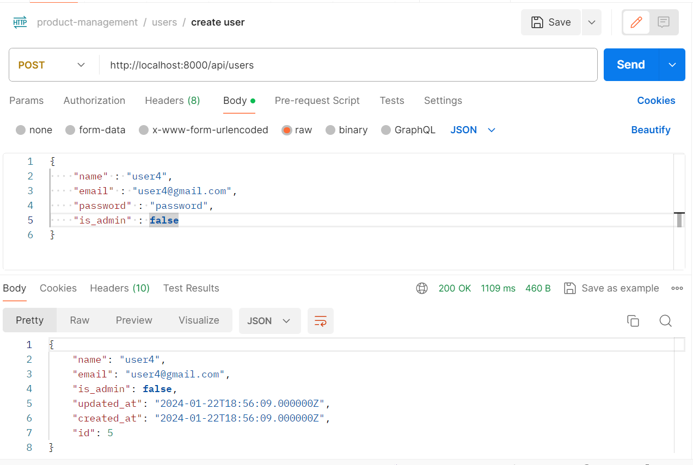
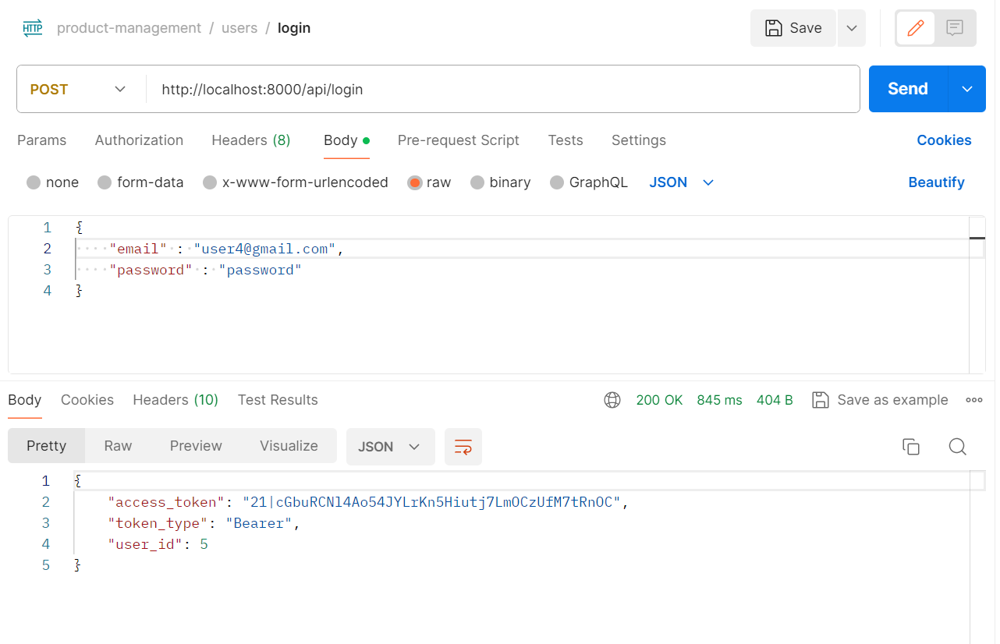
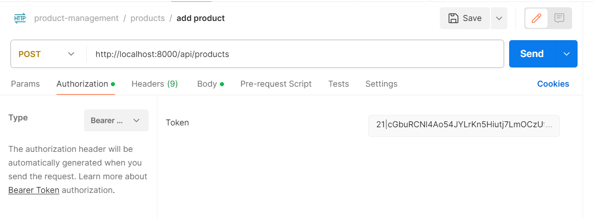
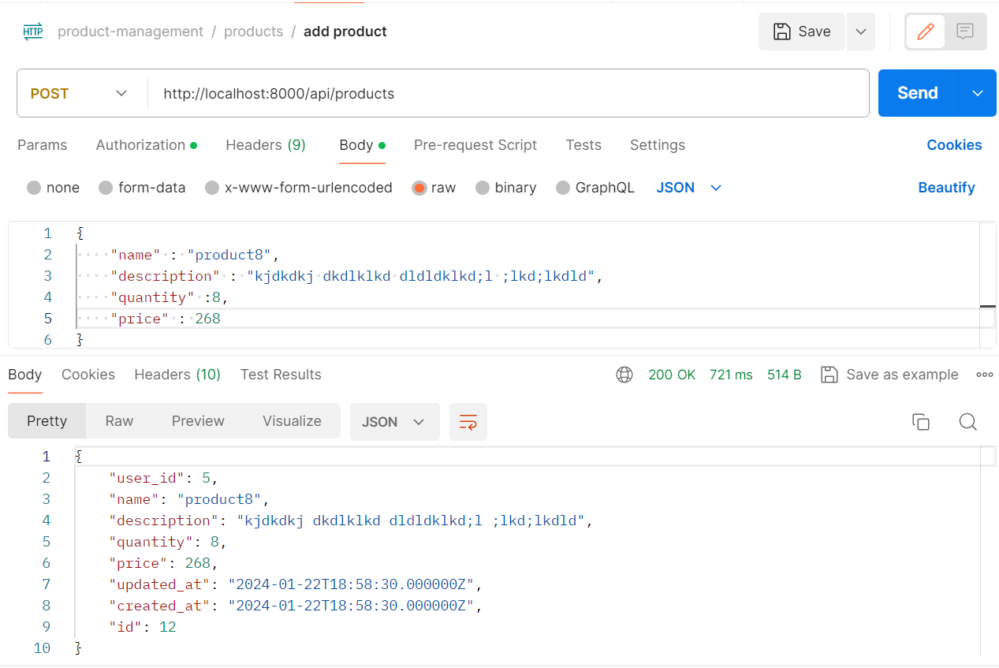
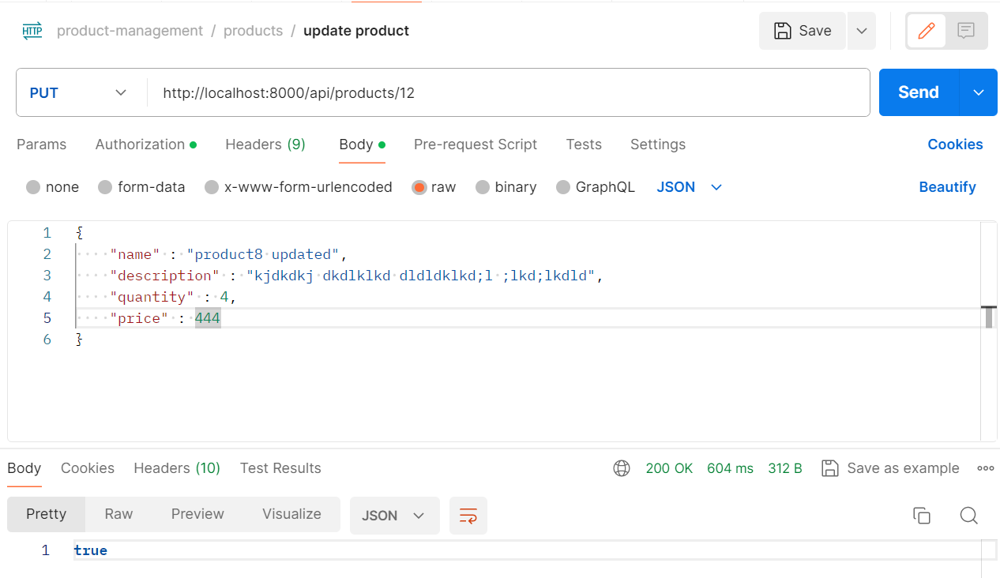
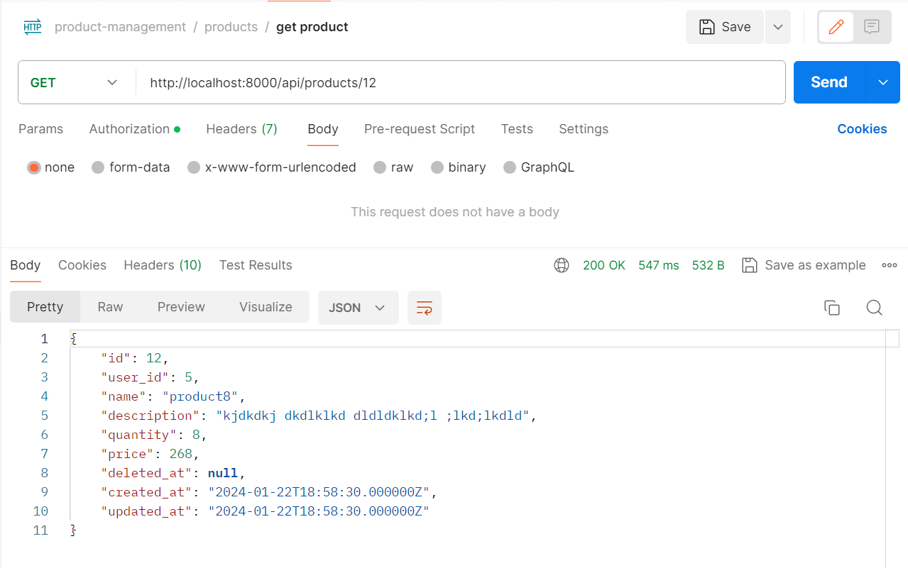
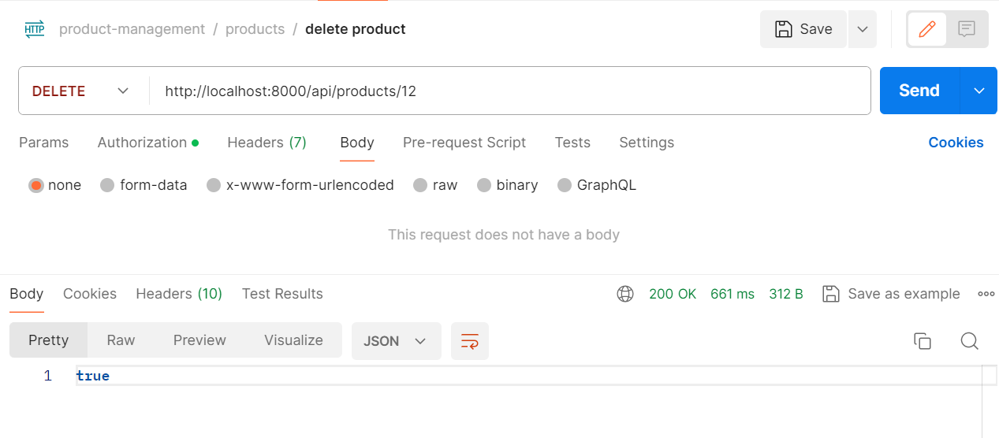
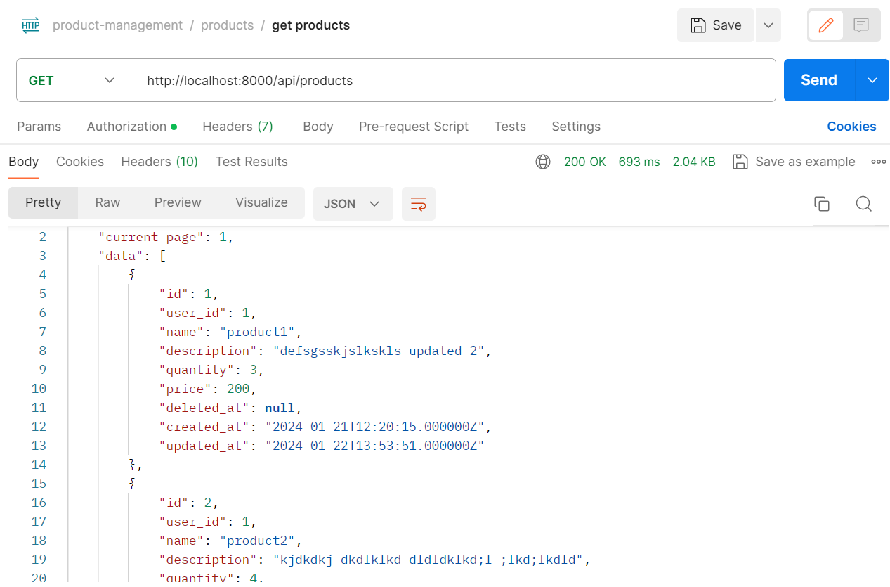

<h1>documentation Postman</h1>

<h5>Register user</h5>

 
<h5>Login</h5>

 
<h5>Authorization</h5>

 
<h5>Create product</h5>

 
<h5>Update product</h5>

 
<h5>Get only product</h5>

 
<h5>Delete product</h5>

 
<h5>Display products</h5>

 